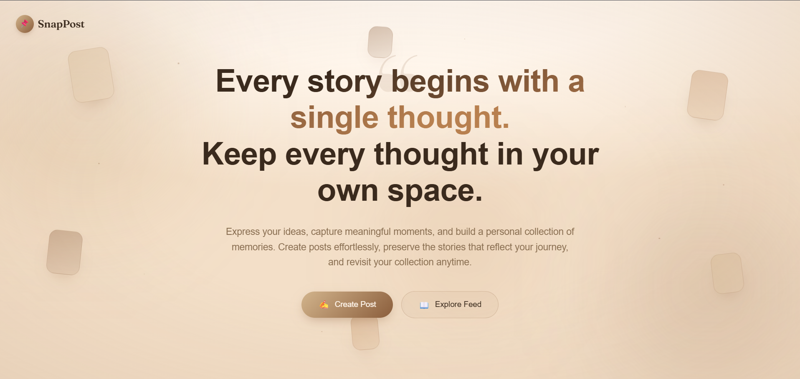
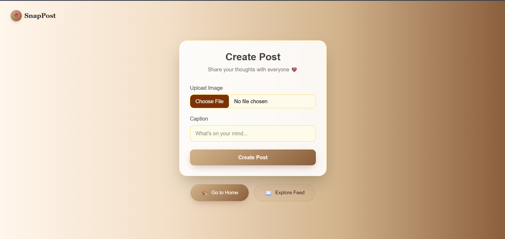
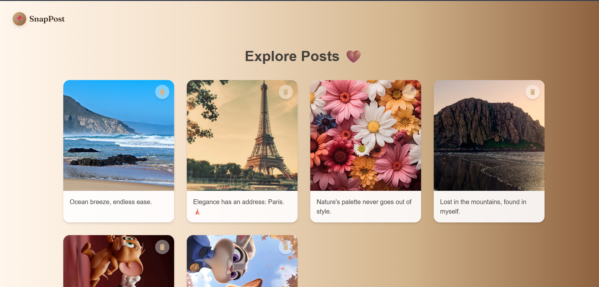

# 📌 SnapPost

<p align="center">
  
  
  
  
  
</p>

<p align="center">
A clean and modern MERN Stack application that lets users create, upload, explore, and manage image-based posts with an elegant and responsive interface.
</p>

---

## ✨ Overview

SnapPost is a full-stack web application where users can:

- 🏠 Land on a beautiful Home Page
- 📝 Create a new post with an image and caption
- 🖼️ Upload images securely to Cloudinary
- 📖 Explore their uploaded posts
- 🗑️ Delete posts instantly
- 📱 Enjoy a fully responsive experience across devices

The project demonstrates complete CRUD functionality along with frontend-backend integration using the MERN Stack.

---

# 📸 Project Preview

## 🏠 Home Page



---

## 📝 Create Post



---

## 🖼️ Explore Feed



---

## 🎥 Project Demo

[▶️ Watch Demo](./Frontend_/src/assets/Project-Preview.mp4)
# ✨ Features

- 🎨 Modern & Minimal UI
- 📱 Fully Responsive Design
- 📤 Upload Images
- 📝 Add Captions
- 📚 Explore Personal Feed
- 🗑️ Delete Posts
- ☁️ Image Storage
- ⚡ REST API Integration
- 💾 MongoDB Database
- 🔥 Fast React Frontend
- 🌐 Live Deployment

---

# 🛠 Tech Stack

## Frontend

- React.js
- Tailwind CSS
- Axios
- React Router

## Backend

- Node.js
- Express.js

## Database

- MongoDB Atlas

## Deployment

- Vercel
- Render

## Version Control

- Git
- GitHub

---

# 📂 Project Structure

```
SnapPost/
│
├── Frontend/
│   ├── src/
│   ├── public/
│   └── package.json
│
├── Backend/
│   ├── controllers/
│   ├── models/
│   ├── routes/
│   ├── config/
│   ├── middleware/
│   ├── server.js
│   └── package.json
│
└── README.md
```

---

# ⚙️ Installation

## 1️⃣ Clone the Repository

```bash
git clone https://github.com/YourUsername/SnapPost.git
```

## 2️⃣ Navigate to Project

```bash
cd SnapPost
```

---

## Frontend Setup

```bash
cd Frontend
npm install
npm run dev
```

---

## Backend Setup

```bash
cd Backend
npm install
npm run dev
```

---

# 🔑 Environment Variables

Create a `.env` file inside the Backend folder.

```env
PORT=5000

MONGO_URI=Your MongoDB URI

CLOUDINARY_CLOUD_NAME=Your Cloud Name

CLOUDINARY_API_KEY=Your API Key

CLOUDINARY_API_SECRET=Your API Secret
```

# 🎯 Workflow

```text
Home Page
     │
     ├──────────────► Create Post
     │                     │
     │                     ▼
     │              Upload Image
     │                     │
     │                     ▼
     │              Save to MongoDB
     │
     ▼
Explore Feed
     │
     ▼
View All Posts
     │
     ▼
Delete Post
```

# 📖 What I Learned

During this project, I improved my understanding of:

- React Component Architecture
- CRUD Operations
- REST APIs
- MongoDB Integration
- Axios
- Express.js
- File Upload Handling
- Responsive UI Design
- Full Stack Deployment

---

# 👩‍💻 Author

**Bhoomi Kaushik**

💼 Full Stack Developer

📧 kaushikbhumika13@gmail.com

🌐 LinkedIn: www.linkedin.com/in/bhoomi-kaushik-145081356

🐙 GitHub: https://github.com/bhumi-95

---

# ⭐ Support

If you liked this project, consider giving it a ⭐ on GitHub!

It motivates me to build more amazing projects.

---

Made with ❤️ using the Full Stack.
